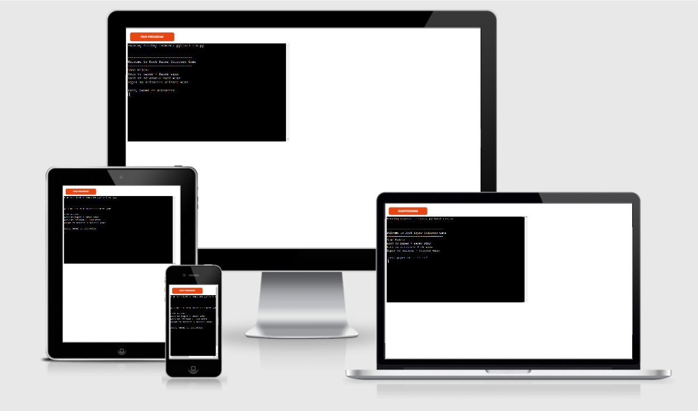
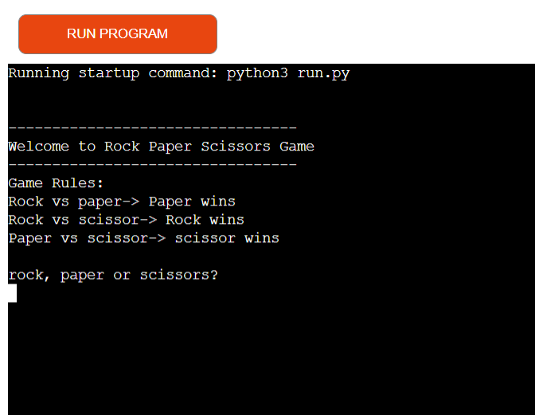
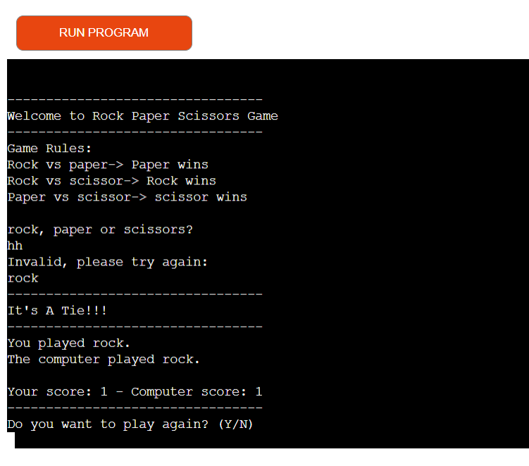

# PAPER SCISSOR ROCK

Paper Scissor Rock game is a Python terminal game that runs on Heroku.

Rock paper scissors are played between two people, in which each player simultaneously forms one of three shapes with an outstretched hand. These shapes are "rock" (a closed fist), "paper" (a flat hand), and "scissors" (a fist with the index finger and middle finger extended, forming a V. If you want you can read more about it on.[Wikipedia](https://en.wikipedia.org/wiki/Rock_paper_scissors)

In this game, the user’s opponent is the computer and the computer chose randomly rock paper and scissors. 
Users of will learn the rules of the game.

[Click here to play the game live](https://rock-paper-scissors-yonas.herokuapp.com/)

## Features 
- A player competing against the computer
- Requires user input  
- The  game includes a score counter

- __Input validation__
  - User can only input rock, paper och scissors 
  - User can only input (Y/N) when asked if they want to play again

## Testing
I have tested this game by doing the following
- __Validator Testing__
  - Passed the code through a PEP8 and confirmed there are no problems.
  - Tested in my local terminal and Heroku terminal.
  - I tested the game by providing invalid data.

## Deployment

   -  Created a new Heroku app for this game
   -  hanged buildingpacks settings by to Python and NodeJS
  -  Linked Heroku app to Github repository
  -  Enabled automatic deploys

## Credits

  - Wikipedia for details of The game. 
  - Code Institue Portfolio projekt scope and Love Sandwiches project.
  - 

